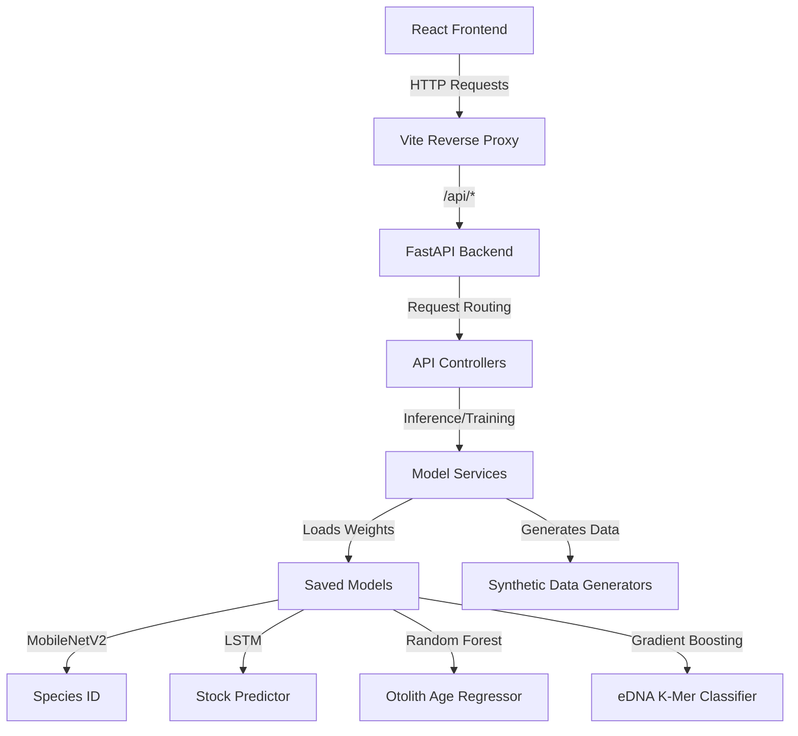

# 🌊 Neural Ocean

[](https://vitejs.dev/)
[](https://fastapi.tiangolo.com/)
[](https://www.tensorflow.org/)
[](https://scikit-learn.org/)

**Neural Ocean** is an AI-driven, interactive platform designed for marine knowledge exploration, species identification, eDNA sequence analysis, and fisheries stock forecasting. It combines a premium glassmorphic frontend React application with an asynchronous FastAPI machine learning backend.

---

## 🚀 Key Features

### 🔍 1. Species Neural ID
* **Image Recognition**: Classify marine species using transfer learning based on the **MobileNetV2** deep learning model.
* **Dynamic Experience**: Powered by an interactive image slider showing vibrant reefs, marine turtles, and bioluminescent sea life.
* **Insightful Analytics**: View top-5 predictions with confidence bars and model metrics.

### 🧬 2. eDNA Analysis (Molecular Abyss)
* **Sequence Classification**: Predict species from environmental DNA samples using a **Gradient Boosting Classifier** trained on normalized k-mer frequency vectors.
* **Shannon Entropy**: Calculates a normalized biodiversity index representing Shannon entropy across categories.
* **Stunning Design**: Features a beautiful looping custom DNA double-helix background animation.

### 🔬 3. Otolith Morphology
* **Age Prediction**: Regression model (**Random Forest Regressor**) predicting fish age and growth patterns from ear bone morphometrics (length, width, weight).
* **Batch Analytics**: Analyze up to 20 samples simultaneously in tabular format.
* **Feature Importance**: View real-time relative weights and importance of each physical parameter.

### 📈 4. Fish Stock Prediction & Analytics
* **Time-Series Forecasting**: Uses an **LSTM Neural Network** to forecast regional fish stock levels with 95% confidence intervals.
* **Deep Metrics**: Interactive charts (Recharts) detailing dataset distributions, records over time, and operational statuses.

### 🌳 5. Interactive Taxonomy Visual Tree
* **Interactive Hierarchy**: Browse marine taxonomy with nested collapsible/expandable nodes.
* **Smooth Animations**: Animated using `framer-motion` inside frosted glass containers.

---

## 🛠️ Tech Stack

### Frontend
* **Core**: React 18, TypeScript, Vite
* **Styling**: TailwindCSS, Vanilla CSS, Glassmorphic components
* **Animations**: Framer Motion, custom CSS transitions
* **Data Visualization**: Recharts
* **Maps**: Cesium 3D Ocean layout maps

### Backend & ML Pipeline
* **API Framework**: FastAPI, Uvicorn
* **Deep Learning**: TensorFlow (MobileNetV2, LSTM)
* **Machine Learning**: scikit-learn (Gradient Boosting, Random Forest Regressor)
* **Data & Image Processing**: NumPy, Pandas, Pillow, Joblib

---

## 🏗️ Architecture



---

## ⚙️ Setup & Installation

### Prerequisites
* **Node.js** (v18 or higher)
* **Python** (v3.10 or higher)

### 1. Backend Setup (FastAPI)
1. Navigate to the backend directory:
   ```bash
   cd backend
   ```
2. Create and activate a Python virtual environment:
   ```bash
   python3 -m venv .venv
   source .venv/bin/activate  # On Windows: .venv\Scripts\activate
   ```
3. Install dependencies:
   ```bash
   pip install -r requirements.txt
   ```
4. Start the FastAPI development server:
   ```bash
   uvicorn main:app --host 0.0.0.0 --port 8000 --reload
   ```
   * The backend API documentation will be available at `http://localhost:8000/docs`.

### 2. Frontend Setup (React + Vite)
1. Install Node modules from the root directory:
   ```bash
   npm install
   ```
2. Start the Vite development server:
   ```bash
   npm run dev
   ```
3. Open `http://localhost:5173` in your browser.

---

## 📁 Repository Structure

```
├── backend/                  # FastAPI Backend
│   ├── api/                  # API routers (species, edna, otolith, stock)
│   ├── data/                 # Synthetic data generators
│   ├── models/               # Saved trained ML models (.keras, .pkl files)
│   ├── schemas/              # Pydantic request/response schemas
│   ├── services/             # Core ML model training & inference services
│   ├── main.py               # FastAPI entrypoint and lifespan managers
│   └── requirements.txt      # Python dependencies
├── src/                      # React Frontend
│   ├── components/           # Reusable components (dashboard, datasets, layout)
│   ├── contexts/             # Auth and application contexts
│   ├── pages/                # Page components (EDNA, Analytics, Taxonomy, etc.)
│   ├── services/             # API client services (mlApi.ts)
│   ├── App.tsx               # Main routing structure
│   └── index.css             # Tailwind and global layout styles
├── package.json              # Frontend node packages and scripts
├── vite.config.ts            # Vite proxy configuration
└── tailwind.config.js        # Tailwind style tokens
```

---

## 🧠 Model Training
If a model status shows as **Untrained** on the dashboard:
1. Navigate to the **ML Dashboard** in the application interface.
2. Click **Train Model** for the desired service (e.g., eDNA, Species) or click **Train All Models**.
3. The server will run training pipelines synchronously and load the updated weights into memory.
